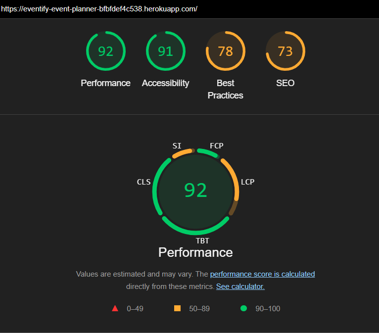

# Eventify Event Planner


[view the full project on GitHub here](https://github.com/taz1003/PP4_Eventify_Event_Planner)

[view the deployed project here](https://eventify-event-planner-bfbfdef4c538.herokuapp.com/)

[view the project MVC framework here](https://github.com/users/taz1003/projects/3/views/1)

## Table of Contents

- Project overview
- Agile methodology
- Key Features
- Technology Stack
- Installation
- Configuration
- Usage
- Admin Features
- Testing
- Major Error Handling
- Deployment
- License
- Credits
- Acknowledgement

## Project overview

Eventify is a comprehensive event management platform built with Django that enables users to create, discover, and manage events. The application provides:

    - User authentication and authorization
    - Event creation and management
    - Attendance tracking with status options
    - Commenting system
    - Date-based event filtering
    - User profiles with event history
    - Dedicated page containing information about the developer
    - Collaboration form


## Agile Methodologyy

    - Using GitHub Kanban Board as the MVC framework
        the whole project was done through step by step process.

    [View the framework here](https://github.com/users/taz1003/projects/3/views/1)


## Key Features

### Event Management

    - Create, edit, and delete events
    - Rich text descriptions with Summernote editor
    - Image uploads via Cloudinary
    - Automatic slug generation
    - Date and location information


### User Interaction

    - Three-tier attendance system (Attending/Maybe/Not Attending)
    - Commenting with CRUD functionality alongside admin-approval workflow
    - User profiles showing created and attended events
    - Password change functionality
    - Visibility to attendee count for an event
    - Willing users can fill up collaboration form, when done, an automated
        email will be sent to the developer


### Discovery Features

    - Paginated event listings
    - Date filtering (All/Upcoming/Past)

### About Page

    - Dedicated page about the information of the developer of this app
    - Collaboration form for others with automated notification system


### Admin Panel

    - Summernote integration for rich text editing
    - Advanced filtering and searching
    - Bulk comment approval
    - Attendance status management
    - Account management
    - Event management


## Technology Stack

### Backend

    - Python 3.13.3
    - Django 5.0
    - Django Allauth (Authentication)
    - Django Crispy Forms (Form styling)
    - Django Summernote (Rich text editing)
    - PostgreSQL (Production)
    - SQLite (Development)
    - Cloudinary (Image storage)
    - EmailJS (Automatic email service)

### Frontend

    - HTML5, CSS3, JavaScript
    - Bootstrap 5
    - Font Awesome (Icons)
    - jQuery (DOM manipulation)

### Deployments

    - GitHub
    - Heroku
    - WhiteNoise (Static files)
    - dj-database-url (Database configuration)

## Installation

### Prerequisites

    - Python
    - pip
    - PostgreSQL
    - Cloudinary account

### Setup Instructions

    - Clone Repository
    - Create and activate a virtual environment
    - Install dependencies:
        ```bash
            pip install -r requirements.txt
        ```
    - Set up environment variables:
        Create a .env file in the root directory with:
        ```bash
            SECRET_KEY=your_django_secret_key
            DATABASE_URL=your_database_url
            CLOUDINARY_URL=your_cloudinary_url
        ```
    - Run migrations:
        ```bash
            python manage.py migrate
        ```
    - Create a superuser:
        ```bash
            python manage.py createsuperuser
        ```
    - Run the development server:
        ```bash
            python manage.py runserver
        ```

## Configuration

### Required Settings

    - Configure DATABASES in settings.py environment
    - Set up Cloudinary credentials in the .env file
    - Update allowed hosts for production domain

### Optional Settings

    - Customize event display limits
    - Adjust pagination settings
    - Modify comment admin-approval workflow

## Usage

### For Event Organizers

    - Create an account or log in
    - Click "Create Event" to add your event details
    - Manage your events through the profile page
    - Monitor attendee responses

### For Attendees

    - Browse events using filters
    - Set your attendance status
    - Leave comments on events
    - Track your events in your profile

### For Admin

    - Access the admin panel at /admin
    - Moderate comments and events
    - Manage user accounts
    - View system analytics

## Admin Features

The admin interface provides:
    - Rich text editing for event descriptions
    - Bulk actions for comment approval
    - Advanced filtering options
    - Quick edit functionality
    - Date-based hierarchy navigation

## Testing

Run the test suite with:

        ```bash
            python manage.py test
        ```

### The application includes tests for

    - View Tests

        - Verifies redirects for unauthenticated users
        - Tests proper attendance status updates for logged-in users
        - Confirms database records are created correctly
        - Tests event creation workflow for authenticated users
        - Validates form submission and redirects
        - Verifies creator assignment and field population
        - Tests comment submission functionality
        - Verifies comment-author-event relationships
        - Ensures proper status codes and template rendering

    - Form Tests
        - Tests valid form submissions
        - Verifies required field validation
        - Checks error messages for invalid data
    

### I have manually tested the project by doing the following

    - Passed the code in all .py(python) files through [PEP8 Linter](https://pep8ci.herokuapp.com/) and confirmed that there are no errors.

    - After running the code present in all the html files through the [W3C Markup Validator](https://validator.w3.org/#validate_by_input), no errors were found.

    -  No errors or issues were returned after running the code present in the style.css file through the [W3 Jigsaw CSS Validator](https://jigsaw.w3.org/css-validator/).

    - I confirmed that the colors and fonts used in this website are easy to read and accessible by running this page through Lighthouse in Chrome DevTools.
    

## Major Error Handling

### ERROR 1

Created test events from admin panel and after trying to connect events/views.py to templates, the events were not showing.
Fixed it by adding context_object_name = 'events' in the EventList view.

### ERROR 2

Issues while creating Attendance model ('relation "events_attendance" already exists', cannot be migrated).
Fixed it by deleting all the migrations (python manage.py migrate events zero) and re-applying migrations.

### ERROR 3

Comment edit and delete functions were't working. Fixed
Fixed it by creating a seperate html for editing and adjusting delete function in comments.js.

## Deployment

### Github

    - Create repository
    - Open Visual Studio Code
    - Click "Clone Git Repository"
    - Click "Clone from GitHUb"
    - Select the repository from GitHub
    - Open terminal to add, commit and push

### Heroku

    - Create a Heroku account and install CLI
    - Create a new app
    ```bash
    heroku create your-app-name
    ```
    - Set environment variables
    ```bash
    heroku config:set SECRET_KEY=your_secret_key
    heroku config:set DATABASE_URL=your_postgres_url
    heroku config:set CLOUDINARY_URL=your_cloudinary_url
    ```
    - Deploy
    ```bash
    git push heroku main
    heroku run python manage.py migrate
    heroku run python manage.py createsuperuser
    ```

## License

This project is licensed under the [MIT](https://choosealicense.com/licenses/mit/) License

## Credits

### Content and Design

    - All descriptive content was written with comprehensive support from [Grammarly](https://app.grammarly.com/) extension.
    - The webpage was designed using [MockFlow Wireframe](https://wireframepro.mockflow.com/).
    - The color palette used in the website was generated using [ColorSpace](https://mycolor.space/) palette generator.

### Code

    - Majority of the code was applied following [Django Documentation](https://docs.djangoproject.com/en/4.2/)
        and the Code Institute Codestar Blog App project.
    - Huge credit to the fellow coders at Reddit, YouTube and Twitter for helping with code snippets
    - Huge credit to fellow Code Institute coders at Slack

## Acknowledgments

    - My mentor and student care team from Code Institute
    - Code Institute Org 
    - Django Software Foundation
    - Bootstrap team
    - Cloudinary for image hosting
    - All contributors to the open-source libraries used
