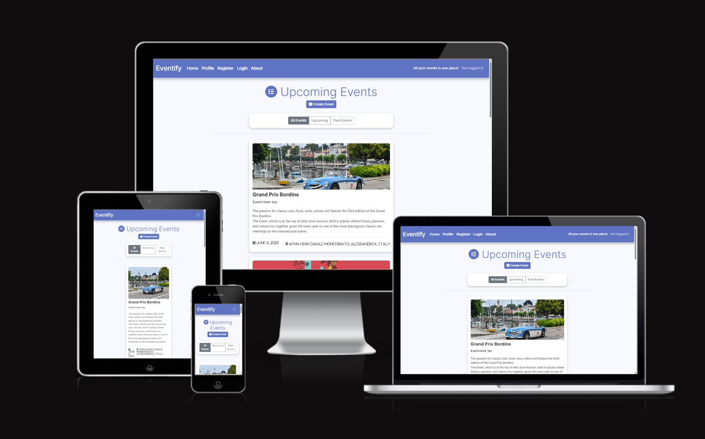

# Eventify Events Webapp

[view the project repository on GitHub here](https://github.com/taz1003/PP4_Eventify_Event_Planner)

[view the deployed project here](https://eventify-event-planner-bfbfdef4c538.herokuapp.com/)

[view the project MVC framework/kanban board here](https://github.com/users/taz1003/projects/3/views/1)

## Table of Contents

- Project overview
- Agile methodology
- Key Features
- Technology Stack
- Installation
- Configuration
- Usage
- Admin Features
- Testing
- Major Error Handling
- Deployment
- License
- Credits
- Acknowledgement

## Project Overview

This project is part of the five milestone projects within the Full Stack Developer course offered by Code Institute. It is the fourth project in this course and represents my understanding of HTML, CSS, JavaScript, Python as well as many different application packages like Django, Cloudinary, SQL etc.

Eventify is a robust, full-featured event management platform built with Django that empowers users to create, discover, organize, and participate in events of all types. The application serves as a centralized hub for event coordination, providing both event creators and attendees with powerful tools to enhance their experience.
Eventify transforms how communities connect through events, providing a seamless bridge between event creators and participants while ensuring a smooth, engaging user experience from discovery through participation.
The application provides:

- User authentication and authorization
- Event creation and management
- Attendance tracking with status options
- Commenting system
- Date-based event filtering
- User profiles with event history
- Dedicated page containing information about the developer
- Collaboration form

### Event Creation & Management

- **Intuitive Event Setup:** Users can easily create events with comprehensive details including title, description, date/time, location, and featured images
- **Rich Text Editing:** Utilizing Django Summernote for enhanced event descriptions with formatting capabilities
- **Smart Slug Generation:** Automatic URL-friendly slugs based on event titles for clean, shareable links
- **Media Integration:** Cloudinary support for reliable image hosting and management

### Event Discovery & Exploration

- **Smart Filtering System:** Browse events by date range (upcoming, past, or all events)
- **Pagination:** Organized browsing experience with paginated results for large event collections
- **Visual Presentation:** Attractive card-based layout with event images, dates, and key information
- **Location Awareness:** Events include location data to help users find nearby activities

### Attendance Management

- **Multi-status RSVP System:** Users can indicate their attendance status with three options:

    1. Attending - Confirmed participation
    2. Maybe - Tentative attendance
    3. Can't Attend - Regretfully declining

- **Real-time Status Updates:** Instant reflection of attendance choices

- **Participation Analytics:** Visual indicators showing how many people are attending each event

- **Attendance History:** Personal track record of event participation in user profiles

### Interactive Engagement

- **Comment System:** Users can share thoughts and questions on event pages by posting comments
- **Comment Moderation:** Approval system for the admin to maintain content quality
- **Edit/Delete Functionality:** Users have control over their own contributions
- **Real-time Interactions:** Dynamic engagement between event organizers and attendees

### User Interface

- **Comprehensive Profiles:** Personal dashboards showing created events and attendance history across all status categories
- **Authentication System:** Secure registration and login using Django Allauth
- **Personalized Content:** Users see events relevant to their interests and participation history
- **Account Management:** Password change functionality from the Profile page

### Admin Interface

**From admin panel I can:**

- see/delete all the users and their emails (not passwords).
- check each user's permissions (staff status/superuser), active status, last login times etc.
- see/edit/delete all the events
- approve/delete comments by users
- change/delete attendance status of users

### Modern Design & UX

- **Responsive Design:** Fully functional across desktop, tablet, and mobile devices
- **Bootstrap Framework:** Clean, professional interface with consistent styling
- **Intuitive Navigation:** User-friendly menu system and clear information architecture
- **Visual Feedback:** Alert systems, modals and status indicators for user actions

## Agile methodology - Development

### User Stories

    - Using GitHub Kanban Board as the MVC framework
    the whole project was done through step by step process.

    [View the framework here](https://github.com/users/taz1003/projects/3/views/1)

## Key Features

### Event Management

- Create, edit, and delete events

- Rich text descriptions with Summernote editor
- Image uploads via Cloudinary

- Automatic slug generation
- Date and location information

### User Interaction

    - Three-tier attendance system (Attending/Maybe/Not Attending)
    - Commenting with CRUD functionality alongside admin-approval workflow
    - User profiles showing created and attended events
    - Password change functionality
    - Visibility to attendee count for an event
    - Willing users can fill up collaboration form, when done, an automated
        email will be sent to the developer

### Discovery Features

    - Paginated event listings
    - Date filtering (All/Upcoming/Past)

### About Page

    - Dedicated page about the information of the developer of this app
    - Collaboration form for others with automated notification system

### Admin Panel

    - Summernote integration for rich text editing
    - Advanced filtering and searching
    - Bulk comment approval
    - Attendance status management
    - Account management
    - Event management

