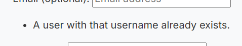

# Eventify Events Webapp

[view the project repository on GitHub here](https://github.com/taz1003/PP4_Eventify_Event_Planner)

[view the deployed project here](https://eventify-event-planner-bfbfdef4c538.herokuapp.com/)

[view the project MVC framework/kanban board here](https://github.com/users/taz1003/projects/3/views/1)

## Table of Contents

- Project overview
- Agile methodology
- Design Choices - The Surface Plane
- Wire Frames - The Skeleton Plane
- Key Features
- Technology Stack
- Installation
- Configuration
- Usage
- Admin Features
- Testing
- Major Error Handling
- Deployment
- License
- Credits
- Acknowledgement

## Project Overview

This project is part of the five milestone projects within the Full Stack Developer course offered by Code Institute. It is the fourth project in this course and represents my understanding of HTML, CSS, JavaScript, Python as well as many different application packages like Django, Cloudinary, SQL etc.

Eventify is a robust, full-featured event management platform built with Django that empowers users to create, discover, organize, and participate in events of all types. The application serves as a centralized hub for event coordination, providing both event creators and attendees with powerful tools to enhance their experience.
Eventify transforms how communities connect through events, providing a seamless bridge between event creators and participants while ensuring a smooth, engaging user experience from discovery through participation.
The application provides:

- User authentication and authorization
- Event creation and management
- Attendance tracking with status options
- Commenting system
- Date-based event filtering
- User profiles with event history
- Dedicated page containing information about the developer
- Collaboration form

### Event Creation & Management

- **Intuitive Event Setup:** Users can easily create events with comprehensive details including title, description, date/time, location, and featured images
- **Rich Text Editing:** Utilizing Django Summernote for enhanced event descriptions with formatting capabilities
- **Smart Slug Generation:** Automatic URL-friendly slugs based on event titles for clean, shareable links
- **Media Integration:** Cloudinary support for reliable image hosting and management

### Event Discovery & Exploration

- **Smart Filtering System:** Browse events by date range (upcoming, past, or all events)
- **Pagination:** Organized browsing experience with paginated results for large event collections
- **Visual Presentation:** Attractive card-based layout with event images, dates, and key information
- **Location Awareness:** Events include location data to help users find nearby activities

### Attendance Management

- **Multi-status RSVP System:** Users can indicate their attendance status with three options:

    1. Attending - Confirmed participation
    2. Maybe - Tentative attendance
    3. Can't Attend - Regretfully declining

- **Real-time Status Updates:** Instant reflection of attendance choices

- **Participation Analytics:** Visual indicators showing how many people are attending each event

- **Attendance History:** Personal track record of event participation in user profiles

### Interactive Engagement

- **Comment System:** Users can share thoughts and questions on event pages by posting comments
- **Comment Moderation:** Approval system for the admin to maintain content quality
- **Edit/Delete Functionality:** Users have control over their own contributions
- **Real-time Interactions:** Dynamic engagement between event organizers and attendees

### User Experience

- **Comprehensive Profiles:** Personal dashboards showing created events and attendance history across all status categories
- **Authentication System:** Secure registration and login using Django Allauth
- **Personalized Content:** Users see events relevant to their interests and participation history
- **Account Management:** Password change functionality from the Profile page

### Admin Interface

**From admin panel I can:**

- see/delete all the users and their emails (not passwords).
- check each user's permissions (staff status/superuser), active status, last login times etc.
- see/edit/delete all the events
- approve/delete comments by users
- change/delete attendance status of users

### Modern Design & UX

- **Responsive Design:** Fully functional across desktop, tablet, and mobile devices
- **Bootstrap Framework:** Clean, professional interface with consistent styling
- **Intuitive Navigation:** User-friendly menu system and clear information architecture
- **Visual Feedback:** Alert systems, modals and status indicators for user actions

## Agile methodology - Development

- Using GitHub Kanban Board as the MVC framework the whole project was done through step by step process.

[View the framework here](https://github.com/users/taz1003/projects/3/views/1)

### User Stories

**I have created the following Epics for the User Stories:**

- User Authentication & Profiles
- Event Management
- Event Browsing & Participation
- Notifications & Feedback

**Following the MoSCoW method, I defined the priorities of each User Stories:**

#### Epic: User Authentication & Profiles

(MUST) - User Registration

- As a new user, I can register with an email, username and password so that I can access event features.
- Registration form validates username email and password input.

(MUST) - Update Password

- As a logged-in user, I can update my password so that I can feel secure.
- Profile page displays editable fields.
- Changes persist after refresh.

#### Epic: Event Management

(MUST) - Create Event

- As a user, I can create an event with a title, date, and description so that others can attend.
- Event form includes title, date, and description fields.
- Summernote editor allows rich text for description.
- Created event appears on the dashboard.

(MUST) - Delete Event

- As a user, I can delete my event so that I can cancel plans.
- User can delete their own events.
- A confirmation modal prevents accidental deletion.

(MUST) - Event Creation with Attendance Options

- As a user, I can create events so that other users can confirm their attendance.
- Event form captures required details.
- Other users can mark “Attending”, "Maybe" or "Not Attending".

(MUST) - Comment CRUD

- As a user, I can create, read, update, and delete my comments so that I can manage my contributions to events.
- Users can add comments to events.
- Users can edit or delete only their own comments.
- All four CRUD operations function correctly.

#### Epic: Event Browsing & Participation

(MUST) - Browse Events

- As a user, I can browse public events so that I can find activities to join.
- Events are displayed in a responsive grid layout.
- Filter allows viewing of all, upcoming, or past events.

(MUST) - View My Events

- As a user, I can view all the events I’ve created or responded to so that I can easily access them.
- Events are grouped by attendance status.
- Each event links to its detail page.

#### Epic: Notifications & Feedback

(MUST) - Collaboration Notifications

- As a dev, I can receive notifications when a user sends a collaboration message so that I stay updated.
- Dev receives email alerts (via Gmail) when a message is submitted.
- User sees a confirmation that their message was sent successfully.

#### Could Have & Won't Have Yet

(Could have) Event Search by Keyword

- As a user, I can search events by keyword (title or description) so that I can quickly find relevant events.
- Adds convenience but not essential for MVP.

(Could have) Profile Pictures

- As a user, I can upload a profile picture so that my identity is more recognisable in events and comments.
- Nice-to-have personalization for the user, but core features still work without it.

(Won't Have Yet) Social Media Integration

- As a user, I want to share events directly to social media platforms (Facebook, Twitter, Instagram) so that I can invite others more easily.
- Useful feature, but considered out of scope for this project phase.

## Design Choices - The Surface Plane

- **Fonts:** Inter, Roboto and sans-serif as fallback from [Google Fonts](https://fonts.google.com/specimen/Inter?query=Inter).

- **Color Pallette**: The color pallette I chose from [AdobeColor](https://color.adobe.com/create/color-wheel) are: `#5e73c2`, `#333`, `#f8f9ff`, `#888eba`.

- **Images**: All of the images were taken from Google Images and I made sure they are copyright free.

## Wireframes - The Skeleton Plane

- I created the wireframes for this project using [Mockflow](https://app.mockflow.com/).
- I designed each page to make sure I don't stumble in the midst of applying bootstrap styling to the website.
- Since Bootstrap’s grid system is 12-column based, I made sure to divide each page as per my design in Mockflow.

- **Homepage**

- **Event Details page**

- **Profile Page**

- **About Page**

- **Mobile screen design**

## Key Features

### Homepage

- The landing page contains a navbar, events list that are paginated and a footer with all the social links
- The events are listed based on their occuring date
- There are 3 buttons for Upcoming, Past and All Events that automatically sort the events for the user

### Event Details and Creation Page

- Users can create, edit, and delete events

- Rich text descriptions with Summernote editor
- Image uploads via Cloudinary during event creation
- Automatic slug generation during event creation
- Date and location information requirement during event creation
- The event creation form does not let users leave blank fields.

- Event details contain image, location, date-time, exerpt and description
- Edit and Delete event buttons for the organizer
- A safety/assurance modal is shown for the user when delete event button is clicked

- Three-tier attendance system (Attending/Maybe/Not Attending) that also shows the attendance count

- Commenting with CRUD functionality alongside admin-approval workflow
- Users can't publish blank comments
- Dedicated comment-edit page
- A safety/assurance modal is shown for the user when delete button is clicked

### Profile Page

- User profiles showing created and attended events along with username

- Password change functionality

### About Page

- Dedicated page about the information of the developer of this app
- Collaboration form for the users with automated emailing system
- Willing users can fill the collaboration form and after clinking on `Send` an automated
email will be sent to the developer
- Notification for the user after the email has been sent to the developer

### SignUp, Login and Logout page

- **I intentionally kept email as optional due to one of my target users being younger students and poeple without access to emails but still willing to create events for their peers and communities**
- **As such I decided to remove `Forgot Your Password` functionality since this requires emails or phone numbers**

- New users have restricted access as they can't create events, post comments etc.
- If they click on Profile link, they are redirected to the signUp page
- Logged in users after clicking on Logout are sent to a confirmation page to make sure accidental logout don't happen
- Users cannot have the same usernames and emails
- Users also cannot leave any of the form element on these pages blank as they are required

### Admin Panel

- Summernote integration for rich text editing
- Advanced filtering and searching
- Bulk comment approval
- Attendance status management
- Account management
- Event management

## Technology Stack

### Backend

- Python 3.13.3
- Django 5.0
- Django Allauth (Authentication)
- Django Crispy Forms (Form styling)
- Django Summernote (Rich text editing)
- PostgreSQL (Production)
- SQLite (Development)
- Cloudinary (Image storage)
- EmailJS (Automatic email service)

### Frontend

- HTML5, CSS3, JavaScript
- Bootstrap 5
- Font Awesome (Icons)
- Google Fonts
- jQuery (DOM manipulation)

### Deployments

- GitHub
- Heroku
- WhiteNoise (Static files)
- dj-database-url (Database configuration)

---

## Installation

### Prerequisites

- Python
- pip
- PostgreSQL
- Cloudinary account

### Setup Instructions

- Clone Repository
- Create and activate a virtual environment
- Install dependencies: `pip install -r requirements.txt`
- Set up environment variables:
    - **Create a .env file in the root directory with:**
        - `SECRET_KEY=your_django_secret_key`
        - `DATABASE_URL=your_database_url`
        - `CLOUDINARY_URL=your_cloudinary_url`
- Run migrations: `python manage.py migrate`
- Create a superuser: `python manage.py createsuperuser`
- Run the development server: `python manage.py runserver`

## Configuration

### Required Settings

- Configure DATABASES in settings.py environment
- Set up Cloudinary credentials in the .env file
- Update allowed hosts for production domain

### Optional Settings

- Customize event display limits
- Adjust pagination settings
- Modify comment admin-approval workflow

## Usage

### For Event Organizers / Users

- Create an account or log in
- Click "Create Event" to add your event details
- Manage your events through the profile page
- Monitor attendee responses

### For Users

- Browse events using filters
- Set your attendance status
- Leave comments on events
- Track your events in your profile

### For Admin

- Access the admin panel at /admin
- Moderate comments and events
- Manage user accounts
- View system analytics

## Admin Features

- Rich text editing for event descriptions
- Bulk actions for comment approval
- Advanced filtering options
- Quick edit functionality
- Date-based hierarchy navigation

---

## Testing

- Please refer to the [testing.md](testing.md) document for all the Tests completed for this project.

---

## Major Error Handling

### ERROR 1

- Created test events from admin panel and after trying to connect events/views.py to templates, the events were not showing.
- Fixed it by adding context_object_name = 'events' in the EventList view.

### ERROR 2

- Issues while creating Attendance model ('relation "events_attendance" already exists', cannot be migrated).
- Fixed it by deleting all the migrations (python manage.py migrate events zero) and re-applying migrations.

### ERROR 3

- Comment edit and delete functions were't working. Fixed
- Fixed it by creating a seperate html for editing and adjusting delete function in comments.js.

---

## Deployment

The main branch of this repository has been used for the deployed version of this application.

### Using Github & VSCode

To deploy my Data application, I used the [Code Institute milestone-project-bring-your-own-data Template](https://github.com/Code-Institute-Solutions/milestone-project-bring-your-own-data).

- Click the 'Use This Template' button.
- Add a repository name and brief description.
- Click the 'Create Repository from Template' to create your repository.
- To create a workspace you then need to click 'Code', then 'Create codespace on main', this can take a few minutes.
- When you want to work on the project it is best to open the workspace from 'Codespaces' as this will open your previous workspace rather than creating a new one. You should pin the workspace so that it isn't deleted.
- Committing your work should be done often and should have clear/explanatory messages, use the following commands to make your commits:
  - `git add .`: adds all modified files to a staging area
  - `git commit -m "A message explaining your commit"`: commits all changes to a local repository.
  - `git push`: pushes all your committed changes to your Github repository.

### Forking the GitHub Repository

By forking the GitHub Repository you will be able to make a copy of the original repository on your own GitHub account allowing you to view and/or make changes without affecting the original repository by using the following steps:

1. Log in to GitHub and locate the [GitHub Repository](repo here???)
2. At the top of the Repository (not top of page) just above the "Settings" button on the menu, locate the "Fork" button.
3. You should now have a copy of the original repository in your GitHub account.

### Making a Local Clone

1. Log in to GitHub and locate the [GitHub Repository](https://github.com/taz1003/breast-cancer-diagnosis-PP5)
2. Under the repository name, click "Clone or download".
3. To clone the repository using HTTPS, under "Clone with HTTPS", copy the link.
4. Open commandline interface on your computer
5. Change the current working directory to the location where you want the cloned directory to be made.
6. Type `git clone`, and then paste the URL you copied in Step 3. `$ git clone (paste url)`
7. Press Enter. Your local clone will be created.

### Deployment To Heroku

- The App live link is: (paste url)
- The project was deployed to Heroku using the following steps.

1. Log in to Heroku and create an App
2. At the Deploy tab, select GitHub as the deployment method.
3. Select your repository name and click Search. Once it is found, click Connect.
4. Select the branch you want to deploy, then click Deploy Branch.
5. The deployment process should happen smoothly in case all deployment files are fully functional. Click now the button Open App on the top of the page to access your App.

---

## License

This project is licensed under the [MIT](https://choosealicense.com/licenses/mit/) License

## Credits

### Content and Design

    - All descriptive content was written with comprehensive support from [Grammarly](https://app.grammarly.com/) extension.
    - The webpage was designed using [MockFlow Wireframe](https://wireframepro.mockflow.com/).
    - The color palette used in the website was generated using [ColorSpace](https://mycolor.space/) palette generator.

### Code

    - Majority of the code was applied following [Django Documentation](https://docs.djangoproject.com/en/4.2/)
        and the Code Institute Codestar Blog App project.
    - Huge credit to the fellow coders at Reddit, YouTube and Twitter for helping with code snippets
    - Huge credit to fellow Code Institute coders at Slack

## Acknowledgments

    - My mentor and student care team from Code Institute
    - Code Institute Org 
    - Django Software Foundation
    - Bootstrap team
    - Cloudinary for image hosting
    - All contributors to the open-source libraries used