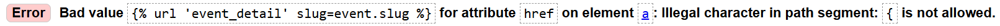
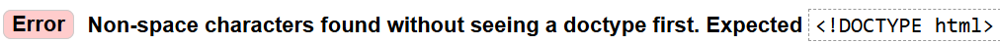
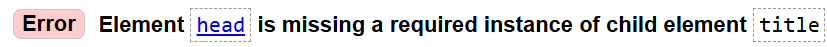
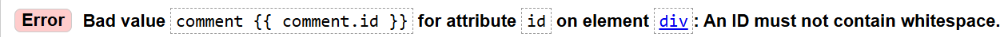
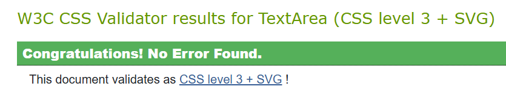
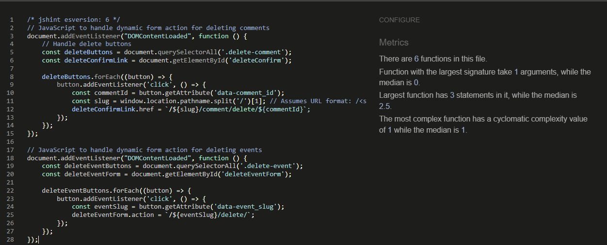
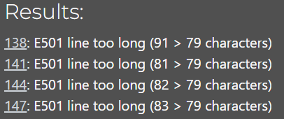
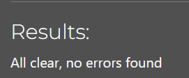
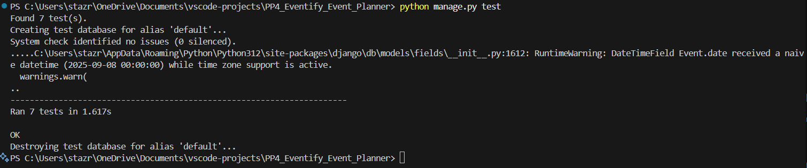
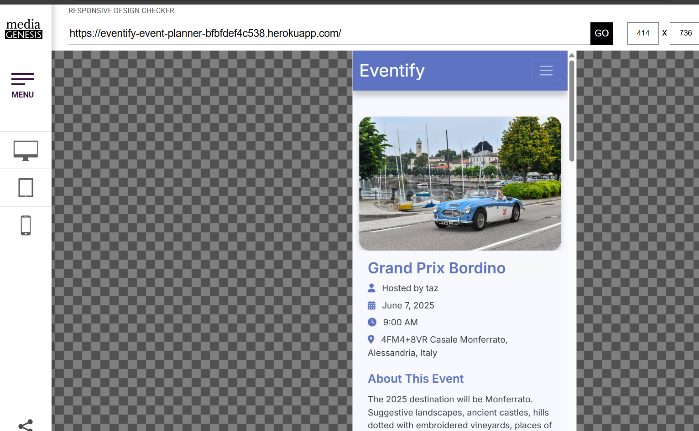

# **Table of contents** #

## **1. Automated Testing** ##

* 1.1 HTML Code Validating
* 1.2 CSS Code Validating
* 1.3 JavaScript Validating
* 1.4 Python Validating
* 1.5 Django Tests

## **2. Manual Testing** ##

* 2.1 Manual testing desktop
* 2.2 Manual testing mobile

## **3. Responsiveness** ##

* 3.1 Chrome Dev Tools
* 3.2 Responsive Design Checker

## **4. Lighthouse Testing** ##

* 4.1 Lighthouse result

<!-- markdownlint-disable MD033 -->

<strong>
1. Automated Testing
</strong>

 

### 1.1 HTML Code Validating ###

**All of the HTML files were tested on the [W3C HTML Markup Validation website](https://validator.w3.org/)**

1. Although I could've tested each specific page of the deployed project using `View page source`, and then copying the html for the validator, I opted for the raw html files for accuracy's sake. The html files that were tested are - base.html, index.html, profile.html, event_form.html, event_detail.html, comment_edit.html, login.html, logout.html and signup.html.

2. In each case a similar Error was shown, for example - `Error: Bad value `.
This can be ignored as the  tags are Django template syntax, which the W3C validator does not understand. It expects rendered HTML, not templates.

3. In each case a similar Error was shown, for example - `Error: Non-space characters found without seeing a doctype first. Expected <!DOCTYPE html>`. This can also be ignored due to the raw file being written using Django template syntax.

4. Such errors are repeated in all the tests for each file, all of which can be ignored since django's  and {{ }} syntax lines never go to the browser. When Django renders the page, it replaces them with real HTML code.
5. Other than the django-syntax errors and infos, no other errors occured during the testing process of the files mentioned above.

### 1.2 CSS Code Validating ###

* The only CSS file was tested on the [W3C CSS  Validation website](https://jigsaw.w3.org/css-validator/)

    1. No errors or issues were returned after running the code present in the style.css file.

    

### 1.3 JavaScript Validating ###

* The testing for the comments.js and events.js files was carried out on [JShint.com](https://jshint.com/)

    1. At first jshint was showing `'const' is available in ES6 (use 'esversion: 6') or Mozilla JS extensions (use moz).`, `'arrow function syntax (=>)' is only available in ES6 (use 'esversion: 6').`. I added `/* jshint esversion: 6 */` above the code snippets which allows jshint to check ES6 features.
    2. No errors or issues were returned after running the code present in the above mentioned files.

    

### 1.4 Python Validating ###

* The testing for the python files were carried out on [Code Institute Python Linter](https://pep8ci.herokuapp.com/)

    1. Main settings.py file - Some of the lines are highlighted as being greater than 79 characters, however the code highlighted was created when I created the project and are the setup settings Django created, therefore they will be ignored as I did not write them and don't want to adjust them lest they should disrupt the app files.

    

    2. The other python files that were tested from the `events`, `eventify` and `about` apps are as follows -

        * manage.py
        * urls.py
        * admin.py
        * forms.py
        * models.py
        * test_forms.py
        * test-views.py
        * views.py
        * tests.py

    3. The results show no errors for each of these files.

    

### 1.5 Django Tests ###

* I have created automated Django tests in each django app in this project. The tests can be found in the tests.py file in `about` app, test_forms.py and test_views.py from `events` app.

* The django tests can be run in the terminal all at once by running the command `python manage.py test`.

* Tests can also be run app by app. To run a specific app test, `about` app for example, run the bash command `python manage.py test about`.

* The application includes tests for -

1. **View Tests**
    * Verifies redirects for unauthenticated users
    * Tests proper attendance status updates for logged-in users
    * Confirms database records are created correctly
    * Tests event creation workflow for authenticated users
    * Validates form submission and redirects
    * Verifies creator assignment and field population
    * Tests comment submission functionality
    * Verifies comment-author-event relationships
    * Ensures proper status codes and template rendering
    * Ensures comments are showed or not based on the approval status

2. **Form Tests**
    * Tests valid form submissions
    * Verifies required field validation
    * Checks error messages for invalid data
    * Tests for required fields in the comment body (although not present in the actual app)

3. **About Tests**
    * Tests for the about page status code
    * Ensures the template is properly loaded

---

<strong>
2. Manual Testing
</strong>

 

### 2.1 Manual testing desktop ###

* All desktop testing was carried out on Chrome, FireFox, OperaGX and Edge. Results listed below will apply to all browsers unless highlighted as otherwise.
* **The Homepage**
    1. The homepage is rendering correctly as intended
    2. Clicking the Eventify label in the top left brings the user back to the home page
    3. Clicking on Register, Login and About link on the navbar takes me to thier respective pages
    4. If not logged in, clicking on Profile link takes me to the Register page
    5. All the events (Upcoming, Past and All) events are shown correctly based on their date.
    6. Upcoming, Past and All buttons sorts out the events correctly
    7. Clicking on an event link takes me to the Event Details page
    8. The pagination is correctly shown and works as intended

* **Event Details Page**
    1. The page renders correctly as intended
    2. Clicking on Edit takes me to the Edit Event page and clicking on Save button takes me back to Event Details page
    3. Delete button shows a modal for safety
    4. Attendance button works perfectly
    5. Typing a comment and submitting works as intended and shows approval status
    6. Clicking on Edit on my comment takes me to edit comment page and pressing Update button returns me accurately
    7. Delete comment button shows a safety modal as intended

* **Profile Page**
    1. The page renders correctly
    2. My username is shown accurately
    3. My created events are listed properly
    4. My Attending, Maybe and Not Attending events are also perfectly listed
    5. Change password section works as intended as it doesnt let me leave a black field if I press Update
    6. Change Password functionality works properly

* **About Page**
    1. The page being correctly loaded shows a picture of me and lets users know a little bit about myself
    2. The collaboration form doesn't let me leave any elements blank if I click Send
    3. After filling the collab form and pressing Send, I checked my email and accurately recieved the mesasge with the user's name and email
    4. I can also see the notification at the bottom that my message has been sent.

* **Logout Page**
    1. Clicking on Logout page takes me to sign-out page
    2. Confirmation for signing out is portrayed accurately
    3. Clicking on Sign Out button redirects me to the homepage as anonymous user with restricted access

* **Admin Page**
    1. If I add '/admin' after the main link, the admin page renders accurately
    2. If I am not logged in as admin, I am not allowed to access the page as intended
    3. From admin panel I can -
        * see/delete all the users and their emails (not passwords).
        * check each user's permissions (staff status/superuser), active status, last login times etc.
        * see/edit/delete all the events
        * approve/delete comments by users
        * change/delete attendance status of users

### 2.2 Manual testing mobile ###

Mobile testing was carried out on the following devices: 

1. iPhone SE/12 Pro/14 Pro Max (Via Chrome Dev Tools)
2. iPad Mini/Air/Pro (Via Chrome Dev Tools)
3. Samsung Galaxy A40/A52/A54
4. Samsung Galaxy S20 Ultra
5. Samsung Galaxy Tab 7
6. Surface Pro 7 (Via Chrome Dev Tools)
7. Samsung Galaxy Z Fold 5

* To prevent repetition of the desktop results, I have only stated the exceptions for mobile usecases.
* All mobile testing was carried out on Chrome, FireFox, Opera and Brave browsers.
    1. The navbar for mobile screens is transformed into a dropdown menu containing all the links
    2. The resolution of images are prefectly rendered
    3. All the pages and their functionalities works properly

---

<strong>
3. Responsiveness
</strong>

 

### 3.1 Chrome Dev Tools ###

* I have checked the site on google dev tools for responsiveness on screen sizes ranging from a maximum size of 2560px X 1969px down to a minimum of 320px X 480px. The site is functioning as intended.

### 3.2 Responsive Design Checker ###

* I have also checked the site on the website [Responsive Design Checker](https://responsivedesignchecker.com/) on all of the pages that are available and the site is functioning as intended.

---

<strong>
4. Lighthouse Testing
</strong>

 

## 4.1 Lighthouse result ##

* I confirmed that the colors and fonts used in this website are easy to read and accessible by running this page through Lighthouse in Chrome DevTools.
* The performance also shows promise as I intend to further develop this project into a better version of what it is today.

    

---
